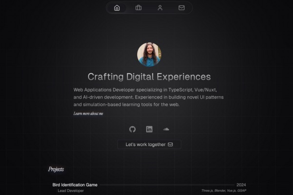

<p align="center">
    <a aria-label="Hugo's Website" href="https://hrcd.fr">
        
  <a aria-label="License" href="https://github.com/hugorcd/canvas/blob/master/LICENSE">
    
    </a>
  <a aria-label="Follow Hugo on Twitter" href="https://twitter.com/HugoRCD__">
    
  </a>
</p>

# Canvas template

This is a fully customizable portfolio template built with [Nuxt.js](https://nuxtjs.org/) and [Tailwind CSS](https://tailwindcss.com/). Use it to showcase your work, testimonials and other information to your clients.

## Demo

You can see a live demo at [canvas.hrcd.fr](https://canvas.hrcd.fr/).

## Deploy with Vercel

[](https://vercel.com/new/clone?repository-url=https%3A%2F%2Fgithub.com%2FHugoRCD%2Fcanvas&env=NUXT_PUBLIC_AVAILABLE,NUXT_PRIVATE_RESEND_API_KEY,NUXT_PUBLIC_STUDIO_TOKENS,NUXT_PUBLIC_MEETING_LINK,NUXT_PUBLIC_SITE_URL&envDescription=You%20will%20require%20an%20API%20key%20for%20Resend%20and%20Nuxt%20Studio%2C%20but%20it%20is%20not%20essential%20for%20the%20portfolio%20to%20work.%20Simply%20add%20%22test%2C%22%20for%20example%2C%20and%20edit%20the%20variable%20later.&project-name=canvas-portfolio&repository-name=canvas-portfolio&demo-title=Canvas&demo-url=canvas.hrcd.fr&demo-image=https%3A%2F%2Fcanvas.hrcd.fr%2Fsocial-preview.jpg)

## Features

- Fully [Nuxt Content v3](https://content.nuxt.com/) driven (collections + `queryCollection`)
- Self-hosted [Nuxt Studio](https://nuxt.studio/) editor support (the `nuxt-studio` module)
- Built-in Awesome Component & Layout
- [NuxtUI](https://ui.nuxt.com/) for some UI components
- [Tailwind CSS](https://tailwindcss.com/)
- Working contact form with [Resend](https://resend.com/)
- [Nuxt i18n](https://i18n.nuxtjs.org/) for multi-language support
- Open Graph Image support with [Nuxt OG Image](https://nuxtseo.com/og-image/getting-started/installation)
- [Nuxt Robots](https://sitemap.nuxt.com/) for auto-generate robots.txt
- [ESLint](https://eslint.org/) with official Nuxt configuration (ESLint v9 with Flat config)
- Full typescript support
- Optimized images with [Nuxt Image](https://image.nuxt.com/)
- [Vue Composition Collection (Vueuse)](https://vueuse.org/)
- Fully responsive on all modern browsers
- Professional and minimal design
- Easy to customize
- Auto generated sitemap

## Quick Setup

1. Clone this repository if you have access or download it from the store
```bash
git clone git@github.com:HugoRCD/canvas.git
```

2. Install dependencies
```bash
bun install
```

3. Start development server
```bash
bun dev
```

4. Generate static project
```bash
bun generate
```

5. Start production server
```bash
bun start
```

## How to Modify the Portfolio Content

This portfolio uses [Nuxt Content](https://content.nuxt.com/) to manage the content. Here's how you can modify it:

First check the `app.config.ts` file to change the global configuration of the portfolio, there is a lot of stuff you can change here.

### Writing

1. Navigate to the `content/2.articles` directory.
2. Here, you'll find Markdown files for each article. To modify an article, simply open its Markdown file and make your changes.
3. To add a new article, create a new Markdown file in this directory. The name of the file will be used as the URL slug for the article.

### Works

1. Navigate to the `content/1.works/` directory.
2. Here, you'll find Markdown files for each article. To modify an article, simply open its Markdown file and make your changes.
3. To add a new project, add a new JSON file in this directory.

#### Featured Works

To change the featured works on the homepage, simply add the `featured: true` key to front matter of the markdown file.

### Other Content

Simply go to the `content/` directory and edit any of the Markdown or JSON files to modify the content.

## Setup the Contact Form

This portfolio uses [Resend](https://resend.com/) to handle the contact form. To set it up, follow these steps:
- Get your api key from [Resend](https://resend.com/) here [your api key](https://resend.com/api-keys)
- Add your api key in the `.env` file
- change the `from` key in the `sendEmail` route in the `server/api/` folder, you can customize everything you want in this route
- That's it, you're good to go!

## Content editing (Nuxt Studio) & deployment

As of 2026, Nuxt Studio is a free, open-source module that runs **inside this app** (the
old hosted `studio.nuxt.com` platform and the `@nuxthq/studio` module are retired). The editor
is therefore deployed together with the site — there is no separate editor deployment.

The repository to commit to is configured in `nuxt.config.ts` under `studio.repository`. To enable
editing/publishing from the deployed site:

1. **Deploy with SSR.** Studio needs a server route for authentication, so the site must be deployed
   with `nuxt build` to an SSR-capable host (Vercel, the current target, works out of the box). A
   purely static `nuxt generate` build cannot serve the editor.
2. **Create a GitHub OAuth app** (Settings → Developer settings → OAuth Apps). Set the callback URL to
   `https://<your-domain>/_studio` (and `http://localhost:3000/_studio` for local testing).
3. **Add the OAuth credentials** as environment variables on the host:
   - `STUDIO_GITHUB_CLIENT_ID`
   - `STUDIO_GITHUB_CLIENT_SECRET`
4. **Open `/_studio`** on the deployed site and sign in. Edits are committed back to the configured
   GitHub repository/branch; your normal CI/CD then redeploys.

Markdown/JSON content under `content/` still builds and serves normally regardless of Studio — Studio
only adds the in-production editing UI. Locally, just edit the files in your editor.

## Setup the Open Graph Image

To change the main open graph image, go to the `app.config.ts` file and change the `openGraphImage` key.
For the blog open graph image, go to the `content/articles` directory and change the `image` key in the Markdown file of the article.

Dynamic OG image URLs should be signed in local and deployed environments. Generate a secret:

```bash
npx nuxt-og-image generate-secret
```

Then set `NUXT_OG_IMAGE_SECRET` in `.env` and in the deployment environment.

<!-- automd:fetch url="gh:hugorcd/markdown/main/src/contributions.md" -->

## Contributing
To start contributing, you can follow these steps:

1. First raise an issue to discuss the changes you would like to make.
2. Fork the repository.
3. Create a branch using conventional commits and the issue number as the branch name. For example, `feat/123` or `fix/456`.
4. Make changes following the local development steps.
5. Commit your changes following the [Conventional Commits](https://www.conventionalcommits.org/en/v1.0.0/) specification.
6. If your changes affect the code, run tests using `bun run test`.
7. Create a pull request following the [Pull Request Template](https://github.com/HugoRCD/markdown/blob/main/src/pull_request_template.md).
   - To be merged, the pull request must pass the tests/workflow and have at least one approval.
   - If your changes affect the documentation, make sure to update it.
   - If your changes affect the code, make sure to update the tests.
8. Wait for the maintainers to review your pull request.
9. Once approved, the pull request will be merged in the next release !

<!-- /automd -->

## Contributing
To start contributing, you can follow these steps:

1. First raise an issue to discuss the changes you would like to make.
2. Fork the repository.
3. Create a branch using conventional commits and the issue number as the branch name. For example, `feat/123` or `fix/456`.
4. Make changes following the local development steps.
5. Commit your changes following the [Conventional Commits](https://www.conventionalcommits.org/en/v1.0.0/) specification.
6. Create a pull request following the [Pull Request Template](https://github.com/HugoRCD/markdown/blob/main/src/pull_request_template.md).
   - To be merged, the pull request must pass the tests/workflow and have at least one approval.
   - If your changes affect the documentation, make sure to update it.
   - If your changes affect the code, make sure to update the tests.
7. Wait for the maintainers to review your pull request.
8. Once approved, the pull request will be merged in the next release !

<!-- /automd -->

<!-- automd:contributors license=Apache author=HugoRCD github="hugorcd/canvas" -->

Published under the [APACHE](https://github.com/hugorcd/canvas/blob/main/LICENSE) license.
Made by [@HugoRCD](https://github.com/HugoRCD) and [community](https://github.com/hugorcd/canvas/graphs/contributors) 💛
<br><br>
<a href="https://github.com/hugorcd/canvas/graphs/contributors">

</a>

<!-- /automd -->

<!-- automd:with-automd lastUpdate -->

---

_🤖 auto updated with [automd](https://automd.unjs.io) (last updated: Thu May 16 2024)_

<!-- /automd -->
